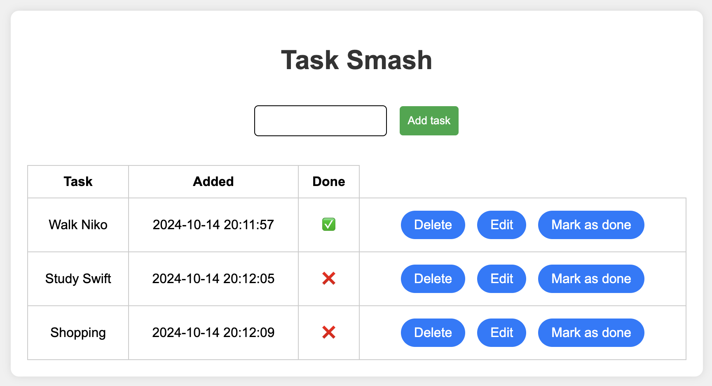

# To-do App

This is a simple to-do list web app built using Flask. It allows users to add, update, and delete tasks.

 

## Features

- Add new tasks
- Mark tasks as complete
- Update existing tasks
- Delete tasks

## Technologies Used

- **Backend**: Python, Flask
- **Frontend**: HTML, CSS, Sass
- **Database**: SQLite
